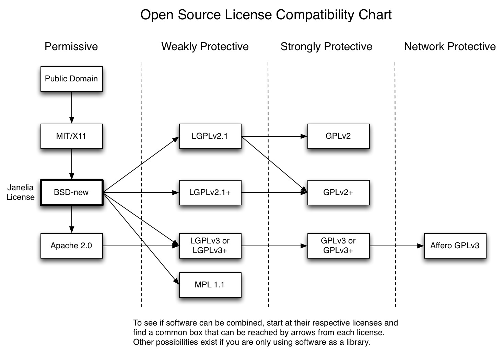

# Workshop Free and open source software

Die Begriffe Free Software, Freie Software oder Open-Source Software kennen wir vermutlich alle. Prominente Beispiele wie den Internetbrowser Firefox, der Systemkernel Linux oder den Medienspieler VLC Player haben vermutlich viele von euch auf euren Rechnern installiert. Auch in vielen anderen Programmen, wie Google Chrome, Microsoft Edge oder Microsoft Teams, steckt Open-Source-Software drin. Doch bedeutet frei, wirklich immer frei ("Free as in freedom of speech" bzw. "Free as in free beer")? Kann ich freie und offene Software immer bedenkenlos verwenden und einsetzen - vor allem als Unternehmen? Räumt mir jede Lizenz das Recht ein die Software zu verwenden, zu verändern und/oder weiterzuverbreiten?

In dieser Schulung möchte ich auf diese und weitere Fragen eingehen. Wir werden uns die grundsätzliche Definition von Free Software und Open-Source Software ansehen und die Unterschiede zwischen den beiden näher beleuchten. Auch werden wir uns genauer mit den bekanntesten Open-Source-Lizenzen auseinandersetzen und deren Freiheiten und Restriktionen kennenlernen. Als Abschluss werde ich euch einige bereits prozessierte Fälle im Zusammenhang mit der Verletzung von Open-Source-Lizenzen vorstellen und euch auch einen (persönlichen) Ausblick auf die weitere Zukunft innerhalb der Open-Source-Bewegung / Open-Source-Community im Zusammenspiel mit kommerziellen Firmen geben.

Agenda:

- Free Software und Open-Source-Software: Was ist das und ist das nicht das selbe?
- Welche Open-Source-Lizenzen gibt es und kann ich diese immer bedenkenlos einsetzen - auch als Unternehmen?
- Was könnte passieren, wenn ich gegen eine Open-Source-Lizenz verstoße?
- Wie sieht die Zukunft von Open-Source Software, vor allem im Anbetracht von großen Tech-Firmen wie Microsoft, Google oder Amazon, aus?

**Disclaimer**: Diese Schulung ist keine Rechtsberatung oder Rechtsbelehrung. In dieser Schulung trage ich nur Informationen vor, die öffentlich im Internet zugänglich sind und bereits von rechtlichen Instanzen, wie Gerichten, geklärt wurden. Die getätigten Aussagen innerhalb dieser Schulung sind nur meine persönliche Meinung und Betrachtung dieses Themas und können/sollten nicht als Grundlage für rechtliche Entscheidungen, sowohl innerhalb der Firma als auch in anderen Kontexten, herhalten. Diese Aussagen sind auch nicht rechtlich geprüft oder mit einer Person aus dem rechtlichen Bereich abgeklärt worden.

## Free Software

Der Begriff *Free Software*, als auch *Freie Software* oder *Libreware* wird für Programme verwendet, die eine uneingeschränkte Verwendung, Verbreitung und Veränderung ihrer selbst erlauben. Dabei ist hier nicht gemeint, dass *Free Software* automatisch kostenlos bzw. gratis oder der Source Code einsehbar ist, sondern dass die Benutzer in der Verwendung des Programms nicht eingeschränkt werden. Großer Verfechter dieser Idee ist der amerikanische Programmierer und Aktivist Richard Stallman, der unter anderem das *Gnu Project* und die *Free Software Foundation* begründet hat. Ihm ist der bekannte Spruch *"Free as in freedom speech, not free as in free beer"*, der innerhalb der Free Software Bewegung gerne zitiert wird, zu zuschreiben.

Damit möchte Stallman ausdrücken, dass Free Software nicht gleichzeitig bedeutet, dass die Software gratis bzw. kostenlos ist. Die Software ist frei in ihrer Verwendung, also frei in ihrer Freiheit.

> "Free software" means software that respects users' freedom and community. Roughly, it means that the users have the freedom to run, copy, distribute, study, change and improve the software. Thus, "free software" is a matter of liberty, not price. To understand the concept, you should think of "free" as in "free speech," not as in "free beer". We sometimes call it "libre software," borrowing the French or Spanish word for "free" as in freedom, to show we do not mean the software is gratis.
>
> \- Free Software Foundation

Im Gegensatz dazu gibt es den Ausdruck *"free as in free beer"* für Freeware, also für Software die immer gratis bzw. kostenlos verwendet werden darf, jedoch der Code nicht öffentlich zugänglich oder veränderbar ist. Diese Unterscheidung ist deshalb nötig, da im englischen Sprachgebrauch kein Unterschied zwischen *"for free"* und *"liberty"* besteht. Darum gibt es hier auch eine große Verwechslungsgefahr zwischen *"libre/free software"*, *"freeware"* und *"open source software"*, da diese sich in einigen Punkten überschneiden bzw. in gewissen Teilen eine ähnliche Philosophie verfolgen.

> - The freedom to run the program as you wish, for any purpose (freedom 0).
> - The freedom to study how the program works, and change it so it does your computing as you wish (freedom 1). Access to the source code is a precondition for this.
> - The freedom to redistribute copies so you can help others (freedom 2).
> - The freedom to distribute copies of your modified versions to others (freedom 3). By doing this you can give the whole community a chance to benefit from your changes. Access to the source code is a precondition for this.
>
> \- Auszug aus der Free Software Definition (the four essential freedoms)

## Open source Software (OSS)

Ein Programm bzw. Software kann als *"open source"* betitelt werden, wenn dessen Code einsehbar ist. Dies soll bewirken, dass das Vertrauen in die Software größer ist, als wenn der Quellcode nicht öffentlich einsehbar ist, da eine große bis unendliche Anzahl an Leuten den Quellcode begutachten kann (*"More eyes, more safety/stable"*). Der Hauptantreiber hinter der Open Source Bewegung ist die *Open Source Initiative*, dessen Definition *Open Source Definition* von Open Source international von einigen Regierungen als der Defacto-Standard anerkannt wird.

> Open source doesn't just mean access to the source code. The distribution terms of open-source software must comply with the following criteria:
>
> 1. Free redistribution: The license shall not restrict any party from selling or giving away the software as a component of an aggregate software distribution containing programs from several different sources. The license shall not require a royalty or other fee for such sale.
> 2. Source code: The program must include source code, and must allow distribution in source code as well as compiled form. Where some form of a product is not distributed with source code, there must be a well-publicized means of obtaining the source code for no more than a reasonable reproduction cost preferably, downloading via the Internet without charge. The source code must be the preferred form in which a programmer would modify the program. Deliberately obfuscated source code is not allowed. Intermediate forms such as the output of a preprocessor or translator are not allowed.
> 3. Derived works: The license must allow modifications and derived works, and must allow them to be distributed under the same terms as the license of the original software.
> 4. Integrity of the author's source code: The license may restrict source-code from being distributed in modified form only if the license allows the distribution of "patch files" with the source code for the purpose of modifying the program at build time. The license must explicitly permit distribution of software built from modified source code. The license may require derived works to carry a different name or version number from the original software.
> 5. No discrimination against persons or groups: The license must not discriminate against any person or group of persons.
> 6. No discrimination against fields of endeavor: The license must not restrict anyone from making use of the program in a specific field of endeavor. For example, it may not restrict the program from being used in a business, or from being used for genetic research.
> 7. Distribution of license: The rights attached to the program must apply to all to whom the program is redistributed without the need for execution of an additional license by those parties.
> 8. License must not be specific to a product: The rights attached to the program must not depend on the program's being part of a particular software distribution. If the program is extracted from that distribution and used or distributed within the terms of the program's license, all parties to whom the program is redistributed should have the same rights as those that are granted in conjunction with the original software distribution.
> 9. License must not restrict other software: The license must not place restrictions on other software that is distributed along with the licensed software. For example, the license must not insist that all other programs distributed on the same medium must be open-source software.
> 10. License must be technology-neutral: No provision of the license may be predicated on any individual technology or style of interface.
>
> \- Open Source Definition

Diese Definition beruht auf den *Debian Free Software Guidelines* von Bruce Perens, die jedoch nicht auf den vier Freiheiten (*"four freedoms"*) der Free Software Foundation beruht.

> 1. Free redistribution.
> 2. Inclusion of source code.
> 3. Allowing for modifications and derived works.
> 4. Integrity of the author's source code (as a compromise).
> 5. No discrimination against persons or groups.
> 6. No discrimination against fields of endeavor, like commercial use.
> 7. The license needs to apply to all to whom the program is redistributed.
> 8. License must not be specific to a product.
> 9. License must not restrict other software.
> 10. Example licenses: The GNU GPL, BSD, and Artistic licenses are examples of licenses considered free.
>
> \- Debian Free Software Guidelines

### Bekannte Open-Source-Lizenzen

Um seinen Quellcode für alle öffentlich zu stellen, benötigt man keine Lizenz an sich. Wenn man sich jedoch gegen gewisse Punkte, wie Copyleft, Haftung und andere rechtliche Aspekte absichern möchte, ist es zu empfehlen eine Open-Source-Lizenz zu verwenden. Dabei gibt es viele solcher Lizenzen, die von verschiedenen Institutionen wie der Free Software Foundation, Apache Software Foundation oder dem MIT bereitgestellt werden. Ich werde hier die wichtigsten Lizenzen auflisten:

- GNU GPLv3: Die Erlaubnis dieser starken Copyleft-Lizenz ist an die Bedingung geknüpft, dass der vollständige Quellcode lizenzierter Werke und Modifikationen, die größere Werke unter Verwendung eines lizenzierten Werks umfassen, unter derselben Lizenz zur Verfügung gestellt werden. Urheberrechts- und Lizenzvermerke müssen beibehalten werden. Die Mitwirkenden gewähren ausdrücklich die Patentrechte.
- Mozilla Public License (MPL): Die Erlaubnis dieser schwachen Copyleft-Lizenz ist an die Bedingung geknüpft, den Quellcode der lizenzierten Dateien und die Modifikationen dieser Dateien unter derselben Lizenz (oder in bestimmten Fällen unter einer der GNU-Lizenzen) zur Verfügung zu stellen. Copyright- und Lizenzvermerke müssen erhalten bleiben. Die Mitwirkenden gewähren ausdrücklich die Patentrechte. Ein größeres Werk, das das lizenzierte Werk verwendet, kann jedoch unter anderen Bedingungen und ohne den Quellcode der Dateien, die in dem größeren Werk hinzugefügt wurden, verbreitet werden.
- Apache License 2.0: Eine freizügige Lizenz, deren wichtigste Bedingungen die Beibehaltung des Urheberrechts und der Lizenzvermerke erfordern. Die Mitwirkenden gewähren ausdrücklich die Patentrechte. Lizenzierte Werke, Änderungen und größere Werke können unter anderen Bedingungen und ohne Quellcode verbreitet werden.
- MIT License: Eine kurze und einfache Lizenz mit Bedingungen, die lediglich die Beibehaltung des Urheberrechts und der Lizenzhinweise vorschreiben. Lizenzierte Werke, Änderungen und größere Werke können unter anderen Bedingungen und ohne Quellcode verbreitet werden.

Jedoch sind nicht alle Lizenzen zueinander kompatibel und bieten unterschiedliche Grade von Restriktionen und Limitierungen. Um eine passende Lizenz zu finden, empfehle ich die Webseite [https://choosealicense.com/](https://choosealicense.com/), die von GitHub zur Verfügung gestellt wird. Es stellt die verschiedenen Lizenzen vor und bietet eine Übersicht, um die richtige Lizenz für den richtigen Einsatz zu wählen. Auch das folgende Bild bietet eine gute Übersicht über die Kompatibilität zwischen den verschiedenen Open-Source-Lizenzen.

*[Quelle: https://janelia-flyem.github.io/images/open_licenses.png](https://janelia-flyem.github.io/images/open_licenses.png)*

Ein bekanntes Beispiel für inkompatible Open-Source-Lizenzen ist z.B. die Situation zwischen den beiden Open-Source-Office-Suiten *OpenOffice* und *LibreOffice*. OpenOffice entstand, aus dem von der deutschen Firma *Star Division* entwickelten, *StarOffice*, indem *Sun Microsystems* die Firma *Star Division* im Jahre 1999 aufgekauft hat. Sun Microsystems veröffentlichte den Quellcode von StarOffice, um eine Open-Source-Entwickler-Community um ein freies und offenes Konkurrenzprodukt zu Microsoft Office herum aufzubauen. Dies war der Startschuss für OpenOffice.

Nachdem Sun Microsystems von *Oracle Corporation* übernommen wurde, wurde auch die Entwicklung von Open Office weitergeführt. Aufgrund Meinungsverschiedenheiten zwischen der Community und Oracle und fehlendem Support vonseiten Oracles wurde die *The Document Foundation* gegründet, die den Quellcode von OpenOffice abgespalten (*fork*) und unter den Namen LibreOffice weiterentwickelt haben.

Bis zur Übertragung des OpenOffice.org-Projekts an Apache Software Foundation wurde OpenOffice unter der LGPLv3 und der *Sun Industry Standards Source License* (SISSL) lizenziert, danach wurde auf die Apache-Lizenz gewechselt. LibreOffice hingegen wurde unter der LGPLv3 und MPLv2.0 mehrfachlizenziert. Somit war es lange Zeit nur möglich Änderungen von OpenOffice in LibreOffice zu übertragen, aber nicht in die umgekehrte Richtung - aufgrund der geschlossenen Entwicklungsvereinbarung zwischen den Entwicklern von OpenOffice und Sun Microsystems, die jegliches Copyright und Besitzansprüche an Sun Microsystems und später Oracle übertragen hatte. Dies hatte zur Folge, dass die Entwicklergemeinschaft von OpenOffice zu LibreOffice wechselte.

## Unterschiede zwischen Free Software und Open Source Software

Nun stellt sich jedoch die Frage, wenn sowohl Free Software als auch Open Source Software ein ähnliches Ziel verfolgen, warum sind diese beiden dann nicht ein und das selbe? Wenn man nach den Aussagen von Richard Stallman zu diesem Thema geht, dann ist Free Software eine Teilmenge von Open Source Software. Open Source Software wird eher als ein Entwicklungsmodell gesehen, im Gegensatz zu Free Software, das eine politische Bewegung repräsentieren sollte. Es wird sich dafür eingesetzt, dass Free Software von jedem, zu jedem Zweck verwendet, verbreitet und verändert werden darf, ohne den Benutzer in seinen Rechten einzuschränken. Hier überschneidet sich Free Software mit den Open Source Prinzipien, da dafür der Quellcode für alle einsehbar, veränderbar und zur Verfügung stehen muss, um die Prinzipien der Free Software zu erfüllen.

Bei Open Source Software geht es darum, dass am besten mehr als eine Person in aller Öffentlichkeit an einem Programmcode arbeitet. Um den Code der Öffentlichkeit zur Verfügung zu stellen, bieten sich die Plattformen GitHub, GitLab oder Bitbucket an. Dort kann der aktuellste Stand von jedem eingesehen, Features und Verbesserungen mittels *Issues/Tickets* angemeldet und Änderungen zur Verfügung gestellt werden. Jedoch kann auch das Beilegen des Quellcodes zum Programm, mittels eines Zip-Files oder in einer anderen lesbaren Form, ausreichend sein, um die Prinzipien von Open Source Software gerecht zu werden.

Dieses angestrebte Modell wird von Eric S. Raymond in seinem Buch *The Cathedral and the Bazaar: Musings on Linux and Open Source by an Accidental Revolutionary* als Bazar bezeichnet. Das Linux-Kernel-Projekt gilt hierfür als das Paradebeispiel. Das Gegenmodell dazu ist laut Raymond die Kathedrale, bei dem der Quellcode nur von einer ausgewählten Gruppe von Leuten entwickelt wird. Als Beispiele sind hierfür die Tools *GNU Emacs* und *GCC* zu nennen. Dabei verfolgt das Bazar-Modell folgende Ansätze:

- Die Benutzer sollten als Co-Entwickler betrachtet werden (*users should be treated as co-developers*)
- Frühes und regelmäßiges Veröffentlichen neuer Versionen (*early releases*)
- Integration neuer Änderungen in regelmäßigen Abständen (*frequent integration*)
- Anbieten verschiedener Versionen (*several versions*)
- Hohe Modularität (*high modularization*)
- Struktur zur dynamischen Entscheidungsfindung (*dynamic decision-making structure*)

Jedoch besagen beide Bewegungen nicht, dass die Software auch gratis bzw. kostenlos zur Verfügung gestellt werden muss. Somit kann Free Software, als auch Open Source Software Geld für die Benutzung der Software verlangen. Auch können beide, unter bestimmten Voraussetzungen, für gewinnbringende Anwendungen verwendet werden. Wird jedoch verlangt, dass die Software gratis bzw. kostenlos sein muss, dann spricht man auch von *Free and open-source software* (FOSS). FOSS kann man auch als den Gegenpol zu proprietäre Software, die eine restriktivere Lizenzierung besitzt und keine Veröffentlichung des Quellcodes anbietet, bezeichnen.

## Prozessfälle

Wenn Free Software und Open-Source-Software sich ohne große Einschränkungen verwenden lässt, dann muss ich mich nicht großartig darum kümmern, ob ich gegen Bestimmungen verstoße, oder? Dieser Gedanke kann sich jedoch schwerwiegend auswirken, da die Freizügigkeit vor allem bei Open-Source-Software nicht automatisch bedeutet, dass ich auf nichts achten muss. Verletzungen gegen Open-Source-Lizenzen gibt es einige und haben auch zu einer großen Diskussion innerhalb der Bewegung geführt.

### Welte vs. D-Link (2006)

Am 6. September 2006 hat das Projekt "gpl-violations.org" vor dem Landgericht Frankfurt am Main gegen die D-Link Germany GmbH wegen der urheberrechtswidrigen Verwendung von Teilen des Linux-Kernels in den von D-Link vertriebenen Geräten obsiegt. In dem Urteil wird festgestellt, dass die GPL gültig und rechtsverbindlich ist und vor deutschen Gerichten Bestand hat.

### Free Software Foundation vs. Xperi (2006)

Der Begriff *Tivorisierung* ist mir damals in meiner Recherche für eine Seminararbeit an der Universität Innsbruck untergekommen. Der Begriff leitet sich von dem digitalen Videorekorder *TiVO* der Firma *Xperi* ab, der auf dem Linux Kernel und auf GNU Software basiert und wurde von Richard Stallman als erstes verwendet. Beide Tools sind unter der GPLv2 lizenziert, die eine Offenlegung des Quellcodes fordert, damit Benutzer den Quellcode verändern und verbessern können. Xperi ist dieser Bedingung in der Form nachgekommen, in dem der Quellcode öffentlich zugänglich ist. Jedoch sind nur Programme auf dem TiVo lauffähig, die mit einer digitalen Signatur, die von Xperi erst freigegeben werden muss, übereinstimmt. Richard Stallman sah darin das Ziel der GPL verletzt, da keine Software, außer die vom Hersteller autorisierte, auf dem Gerät lauffähig ist. Somit sei der Benutzer in seiner Freiheit, seine oder andere freie Software auf dem TiVo zu installieren.

Bradley Kuhn von der *Software Freedom Conservancy* widersprach Stallman in dieser Hinsicht, da Xperi nicht direkt den Austausch und Benutzung der Software verhinderte, sondern nur den Austausch der Open-Source-Komponenten. Der Benutzer des TiVo's müsste sich nur um eine vollständige Open-Source-Alternative umsehen. Kuhn sah deshalb beim TiVo auch keine *Tivoisierung* vorliegen. Die GPLv2 sei schon gegen Fälle von Tivoisierung geschützt und mache deshalb auch den Nachfolger der GPLv2, die GPLv3, überflüssig. Die GPLv3 wurde aufgrund des Vorfalls mit dem TiVo-Gerät hervorgebracht, um den Benutzer das Recht einzuräumen auch modifizierte und veränderte Software zu verwenden, ohne das die Hardware es verbietet. Die Neuerungen in der GPLv3 sind

- ein besserer Umgang mit Fällen von Tivoisierung, also dem Verhindern von alternativer Software durch Hardwarebeschränkungen,
- eine verbesserte Kompatibilität zu anderen Open-Source-Lizenzen,
- eine genauere Definition im Umgang mit *Digital Right Managements* (DRMs).

Linus Torvalds, der Erschaffer und Maintainer des Linux Kernels, sah im Falle des TiVo's auch keine Verletzung gegen die GPLv2 und widersprach auch der Ansicht Richard Stallmans. Laut Torvalds hat Xperi nichts falsches gemacht und dies sei auch von der Free Software Foundation so beobachtet worden. Der Kernel ist zwar unter einer Open-Source-Lizenz, jedoch nicht der Boot-Loader oder die Hardware an sich. Somit müsse Xperi auch nicht dem Benutzer erlauben, andere Software, als die von ihnen autorisierte, zu akzeptieren. Linus Torvalds entschied sich dementsprechend auch gegen eine Neulizenzierung des Linux Kernels auf die GPLv3, da diese zu restriktiv sei.

Das alles führte dazu, dass TiVo zwar die neue GPL-Version wahrnahm, jedoch keine Neulizenzierung der Software des TiVo's in Betracht gezogen hat. Xperi äußerte zwar Bedenken, dass im Falle einer weiten Akzeptanz der GPLv3 und einer eventuellen, zukünftigen Neulizenzierung des Linux Kernels, sie sich nicht imstande sehen Änderungen am GNU/Linux Betriebssystem in ihren TiVo zu integrieren. Dies würde sich massiv auf ihr Geschäftsfeld auswirken.

Auch der Linux Kernel und andere Anbieter von eingebetteter Hardwaresysteme, wie z.B. BusyBox, sahen von einer Neulizenzierung auf die GPLv3 zum derzeitigen Stand ab. Somit verbleibt der Linux Kernel als auch andere Open-Source-Software noch auf dem Stand der GPLv2. Eine Neulizenzierung des Linux Kernels auf eine andere Open-Source-Lizenz würde sich, laut anderen Linux-Kernel-Entwicklern, wie z.B. Alan Cox, schwierig gestalten, aufgrund der großen Anzahl an verschiedenen Copyright-Besitzern am Linux Kernel. Darum besitzt der Linux Kernel, im Gegensatz zu anderen GNU Softwarebestandteilen, nicht den Zusatz *"oder, nach ihrer Wahl, jede spätere Version (or, at your option, any later version)"*. Dies würde die Zustimmung aller Copyright-Besitzern am Linux Kernel benötigen, um den gesamten Linux-Kernel neu zu lizenzieren.

### Jacobsen vs. Katzer (2008)

Jacobsen und andere Softwareentwickler starteten die Entwicklung des *Java Model Railroad Interface* (JMRI) Projekts als Open-Source-Projekt auf der Plattform *SourceForge.net* im Jahre 2000. Diese Software soll es ermöglichen Modelleisenbahnen auf einem Layout von Schienen einer Modelleisenbahn zu steuern. Dafür wurde die Software unter die *Artistic License* lizenziert und ohne Kosten zur Verfügung gestellt. Es wurde jedoch auch individuell angepasste Software direkt an Modelleisenbahner und Händler von dem JMRI Projekt verkauft.

Katzer auf der anderen Seite ist der Inhaber der Firma *KAMIND Associates Inc.*, die mehrere Patente in der Industrie der Modelleisenbahnen besitzt. Katzer behauptete, dass das JMRI Projekt gegen eines dieser Patente verstößt und klagte daraufhin Jacobsen und das JMRI Projekt. Im Gegenzug verklage das Jacobsen Katzer mit der Behauptung, dass Katzer's Software Textdateien aus dem JMRI Projekt verwendet und somit gegen das Urheberrecht und den *Digital Millennium Copyright Act* (DMCA) verstößt. Katzer bzw. KAMIND Associates Inc. habe den Code von Jacobsen bzw. des JMRI Projekts in sein kommerzielles Produkt kopiert, ohne einen Verweis auf die Quelle des Codes zu hinterlegen.

Nach mehreren Verhandlungsrunden und Revisionen kam es zu einer Vereinbarung zwischen Jacobsen und Katzer. Dabei einigten sich beide Parteien auf folgende Vereinbarungen, dass

1. auf eine dauerhafte Unterlassungsverfügung, die es Katzer untersagt, "JMRI-Material durch Herunterladen oder andere zu reproduzieren, JMRI-Material zu verändern oder JMRI-Material zu verbreiten".
2. Durch den Vergleich wurden die beiden Parteien für immer von der Verfolgung bekannter oder unbekannter Ansprüche, die bis zum Vergleichsdatum bestanden, ausgeschlossen. Die Vereinbarung bezog sich auf "alle Ansprüche, die auf JMRI-Material beruhen oder damit in Zusammenhang stehen". Diese Vergleichsbedingung galt für JMRI, JMRI-Endnutzer und JMRI-Entwickler bis zum Datum der Vergleichszahlung.
3. Abweisung aller anhängigen Angelegenheiten, einschließlich der Berufung beim Federal Circuit, Jacobsen gegen Katzer et al., Nr. 2009-1221.
4. Katzer/KAM einigten sich auf eine Zahlung von 100.000 Dollar an Jacobsen.
5. Die Vergleichsvereinbarung beendete alle mündlichen und stillschweigenden Lizenzen zwischen den Parteien.
6. 10 Jahre lang keine rechtlichen Schritte gegeneinander einzuleiten und künftige Streitigkeiten einem Schiedsgericht zu übergeben. Dies galt nur für Jacobsen und Katzer/KAM, nicht für JMRI, JMRI-Endnutzer oder JMRI-Entwickler.
7. dass die Vergleichsvereinbarung sich nicht auf neu herausgegebenes geistiges Eigentum von Katzer oder spätere JMRI-Softwareversionen bezieht, die nach dem Vergleichsdatum erscheinen.

Der Fall Jacobsen ist im amerikanischen Urheberrecht bemerkenswert, weil die Gerichte die Durchsetzbarkeit von Lizenzvereinbarungen sowohl für Open-Source-Software als auch für proprietäre Software geklärt haben. In diesem Fall wurde die Rechtsregel aufgestellt, dass die Bedingungen der Artistic License 1.0 "durchsetzbare Urheberrechtsbedingungen" sind. Dies hatte auch Auswirkungen auf andere Open-Source-Lizenzen und deren Durchsetzbarkeit.

### Free Software Foundation vs. Cisco Systems (2009)

Die Free Software Foundation (FSF) verklagte *Cisco Systems* aufgrund Lizenzverletzungen seitens Cisco Systems in den Produkten ihrer Submarke *Linksys*. Die FSF hielt an verschiedenen von Cisco Systems verwendeten Software-Tools das Urheberrecht, wie z.B. the *GNU C-Compiler* (GCC), *GNU Binutils* und die *GNU C Library*. Die meisten dieser Tools wurden unter die GPLv2 lizenziert, einige andere unter der GNU Lesser Public License (LGPL).

Das *Software Freedom Law Center* (SFLC) vertrat die FSF vor Gericht gegen Cisco Systems. In diesem Verfahren wurde Cisco Systems vorgeworfen, dass in mehreren Produkten von Linksys und im Programm *QuickVPN* copyright geschützter Code von der FSF gefunden wurde. Beide Parteien einigten sich darauf, dass ein Direktor bei Cisco Systems installiert wird, der sicher stellen sollte, dass alle Linksys Produkte im Einklang mit freien Softwarelizenzen sind. Auch eine finanzielle Zuwendung von Cisco Systems an die Free Software Foundation wurde vereinbart.

### Rothschild Patent Imaging vs. GNOME Foundation (2019 - 20022)

Die aus Florida stammende Firma Rothschild Patent Imaging (RPI) verklagte die GNOME Foundation aufgrund Patentverletzungen in der Bildorganisator-Programm *Shotwell*. Zuerst wurde die GNOME Foundation durch die Rechtsanwaltskanzlei *Shearman & Sterling* vor Gericht vertreten und 2020 in einem Vergleich zwischen beiden Parteien geschlossen. Durch eine spätere, neue, gerichtliche Überprüfung der Ansprüche auf das Patent wurde durch *Defease Patents* eingereicht, mit dem Ergebnis, dass jeder dieses Patents zu Unrecht erteilt wurde. Im Jahre 2022 folgte eine Bescheinigung durch das US-Patentamt (USPTO), dass alle Ansprüche an dem Patent in ihrer Gesamtheit für ungültig erklärt wurde. Das Geschäftsmodell von Rothshild Patent Imaging war es, Patente zu erwerben, Gesellschaften mit beschränkte Haftung (GmbH), die einen Teil dieser Patente hielten, zu gründen und dann andere Organisationen und Personen zu verklagen, die vermeintlich gegen diese Patente verstoßen.

Die GNOME Foundation wehrte sich mit einer Klage gegen den Eigentümer von RPI, Leigh Rothschild, die zum Ziel hatte, einen Vergleich mit Leigh Rothschild zu erzielen, der alle Patentdrohungen vonseiten Rothschild aus Open-Source-Projekten zu beseitigen.

## Weiterer Umgang mit Open-Source-Projekten in kommerziellem Umfeld

Open-Source-Programme und Software ist in der heutigen Welt ein fester Bestandteil. Die Open-Source-Bewegung hat viele großartige und innovative Lösungen hervorgebracht und diese für die Öffentlichkeit zur Verfügung gestellt. Hier sind z.B. zu nennen, dass

- ein Großteil der im Internet betriebenen Webserver auf Linux-Betriebssysteme setzt.
- Google Chrome auf dem Open-Source-Projekt *Chromium* und auf die Browser-Engine *Blink* basiert. Chromium und Blink werden auch von anderen Firmen wie Opera, Brave, Microsoft und Samsung dazu verwendet, um eigene Browser oder sogar das Software-Framework *Electron* zu entwickeln.
- die Mozilla Foundation mit dem Open-Source-Browser *Firefox* und der Browser-Engine *Gecko*.
- Visual Studio Code bzw. VSCodium als Open-Source-Entwicklungseditor verfügbar ist.
- .NET ab .NET Core 1.0 von Microsoft Open-Source gestellt wurde.

Diese und viele weitere Projekte werden von einer großen Community aus Freiwilligen und Firmen, Institutionen und Gruppierungen betrieben mit oder ohne einem dahinterliegenden Geschäftsmodell. Entweder beteiligen sich Personen innerhalb ihrer Freizeit an diesen Projekten oder werden durch beteiligte Firmen wie IBM, Microsoft oder Google angestellt, um Open-Source-Projekte aktiv zu unterstützen und sicherzustellen, dass die Entwicklung gesichert ist.

Doch basierend auf der Arbeit dieser Open-Source-Community machen viele Firmen auch Profit, indem sie Open-Source-Software innerhalb ihrer kommerziell vertriebenen Produkte eingesetzt wird. Dabei wird vonseiten von Open-Source-Entwicklern und Vertretern kritisiert, dass der zurückfließende Support seitens der Firmen in einem ungleichen Verhältnis zu den erwirtschafteten Erträge stehen und somit die Arbeit der Open-Source-Community ausgenutzt wird. Das Überleben eines Open-Source-Projektes hängt von der finanziellen und arbeitsmäßigen Unterstützung ab, die es von anderen Beteiligten, Usern und Nutznießern bekommt. Darum sehen sich zunehmend Projekte dazu gezwungen ihre Software bzw. Produkte unter eine Doppellizenz zu stellen, die auf die kommerzielle Verwendung der Software abzielt.

Dazu seien einige bekannte Beispiele aus der .NET Community zu nennen

- ImageSharp von SixLabors, eine der bekanntesten Grafik-Bibliotheken im .NET Umfeld, hat sich dazu entschieden für den kommerziellen Einsatz ihrer Software eine monatliche Gebühr zu verlangen. Diese Gebühr gilt für den Einsatz in proprietären Anwendungen von Firmen/Individuen mit einem jährlichen Umsatz von mehr als eine Million US-Dollar Umsatz.
- QuestPDF, eine PDF-Generator vollkommen geschrieben in C\#, hat ihr Lizenzmodell auf ein ähnliches Modell umgestellt. Dabei wird wieder für Firmen/Individuen, die mehr als eine Million US-Dollar im Jahr Umsatz erzielen, eine Gebühr fällig. Hier wird aber auch noch unterschieden in der Anzahl der Mitarbeiter, die mit QuestPDF arbeiten. Unter zehn Entwicklern ist nur die *Professional License* zu erwerben, über zehn Entwickler die *Enterprise License*.
- IdentityServer, nach Version 4.1.2, wird auch nur mehr von Duende Software, dahinter stehen die ursprünglichen Entwickler vom Legacy-IdentityServer, in einem dualen Lizenzmodell angeboten. Hierbei wird auch die eine-Millionen-Grenze des Jahresumsatz angewendet.
- Uno Platforms, eine alternative zu Microsoft's .NET MAUI, ist vom Grund auf schon durch eine Firma, die den Support und die Entwicklung von Uno Platforms sicherstellt, gesichert.
- Microsoft's .NET Foundation unterstützt auch die Entwicklung von einigen Open-Source-Projekten wie DocFX, Akka.NET, xUnit, Mailkit, AutoMapper und vielen mehr. Jedoch ist hier in letzter Zeit auch der zunehmende Einfluss Microsoft's Gegenstand von Kritik.
- Moq zeigte auch die Problematik innerhalb der Open-Source-Community auf. Der Entwickler von Moq hatte mit Sponsorlink, ohne Einverständnis der Community, ein Tool in Moq implementiert, dass zuerst Closed-Source war und automatisch E-Mails aus den Git-Config-Dateien ausgelesen und an den Server/Betreiber von Moq's Hauptentwickler Daniel "kzu* Cazzulino geschickt.

Diese zunehmende Entwicklung zu dualen Lizenzen und zu vermehrten Einfluss von großen Tech-Firmen ist jedoch mit Vorsicht zu sehen, vor allem für Unternehmen. Open-Source-Entwickler können sich entscheiden, das Projekt wie gehabt weiterzuentwickeln und auf den Support aus der Community zu hoffen, auf eine duale Lizenz umzustellen, es zu kommerzialisieren oder es einzustampfen. Alle Szenarien sind jedoch immer mit der Sorge verknüpft, dass diese eine Auswirkung auf die eigenen, entwickelten Produkte haben. Sei es dadurch, dass man mit neueren Versionen in das duale Lizenzschema fällt und somit eine monatliche Gebühr zahlen muss oder, dass die Entwicklung eines wichtigen Tools beendet und somit zu einer Gefahr für die Stabilität, Sicherheit und Erweiterbarkeit der eigenen Software wird.

Ich denke, dass sich die Open-Source-Community viel in die Richtung der dualen Lizenzierungen bewegen wird und auch versuchen wird, im Hintergrund einen kommerziellen Zweig aufzubauen, der die Finanzierung und Unterstützung sichert. Wenn man jedoch weiterhin von solchen Projekten profitieren möchte, muss man sich auch überdenken, wie und in welcher Art man diese unterstützen kann.
